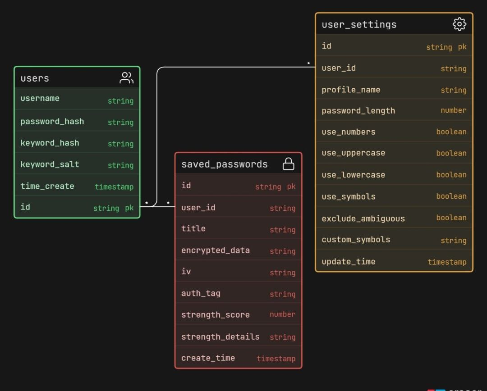

# База данных

## Технологии
- Yandex Database (YDB) в serverless-режиме
- YQL (Yandex Query Language)

## Таблицы
1. `users` — пользователи
2. `user_settings` — профили настроек генерации
3. `saved_passwords` — зашифрованные пароли

## Создание таблиц
Таблицы создаются через веб-интерфейс Yandex Cloud Console.

_Альтернативно:_ выполнить скрипт `schema.yql` в SQL-редакторе YDB.

## Модель базы данных
